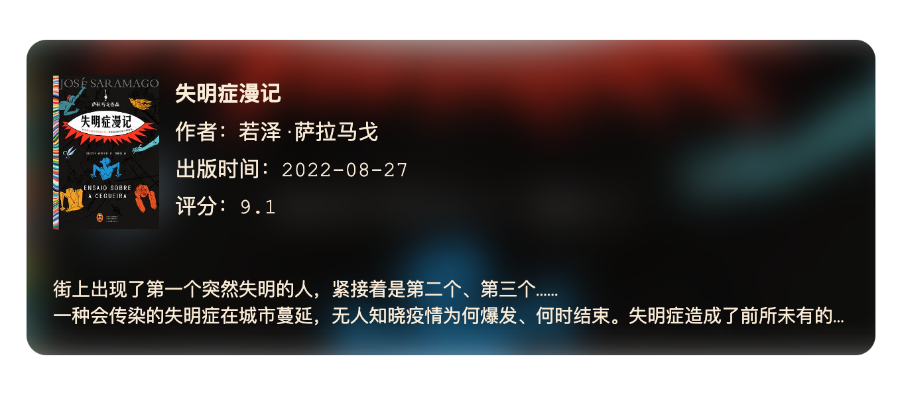
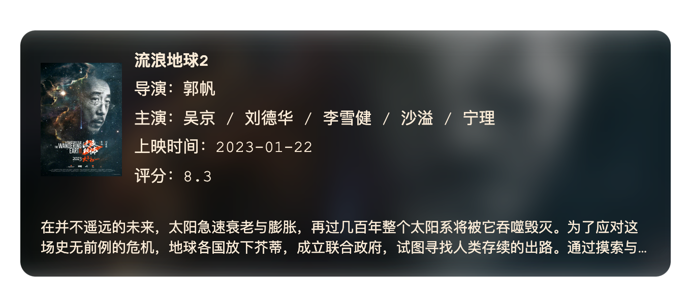

# Remark Media Card

[](https://www.npmjs.com/package/@zhouhua-dev/remark-media-card)

[英文](./readme.en.md)

## 关于本插件

这是一个适用于 [Remark](https://github.com/remarkjs/remark) 的插件，用于在 Markdown 中插入媒体信息卡片，比如豆瓣书籍、音乐、电影等。

本项目受 [hexo-douban-card](https://github.com/TankNee/hexo-douban-card) 的影响，参考了卡片样式的设计和实现，但没有实现豆瓣信息抓取的能力，而是开放了各种信息的输入，由使用者自由配置卡片展示内容，这些内容可以与豆瓣完全无关。

## 安装

```bash
npm install @zhouhua-dev/remark-media-card
```

## 示例与效果展示

<div align="cneter"></div>

````
```media-card
type: book
url: https://book.douban.com/subject/35984787/
title: 失明症漫记
cover: https://img3.doubanio.com/view/subject/s/public/s34269503.jpg
publishDate: 2022-08-27
author: 若泽·萨拉马戈
rating: 9.1
width: 600
introduction: |-
  街上出现了第一个突然失明的人，紧接着是第二个、第三个……
  一种会传染的失明症在城市蔓延，无人知晓疫情为何爆发、何时结束。
  失明症造成了前所未有的恐慌与灾难，一批又一批感染者被集中隔离。
  食物短缺，组织崩溃，文明与尊严变得不堪一击。
  人们逐渐剥离道德的外衣，陷入比失明更绝望的苦难境地。
  在这些人中，只有一个女人还能看见。
  她的眼睛，是这个疯狂的世界里唯一尚存的理智。
```
````

---


<div align="cneter"></div>

````
```media-card
type: music
url: https://music.163.com/#/song?id=19292984
title: Love Story
cover: https://p1.music.126.net/GZERNplXUdzTPkKqo2F4tA==/109951169217536854.jpg
artist: Taylor Swift
width: 600
```
````
---

<div align="cneter"></div>


````
```media-card
type: movie
url: https://movie.douban.com/subject/35267208/
title: 流浪地球2
cover: https://img9.doubanio.com/view/photo/s/public/p2885842436.jpg
director: 郭帆
actors: 吴京 / 刘德华 / 李雪健 / 沙溢 / 宁理
publishDate: 2023-01-22
rating: 8.3
introduction: |-
  在并不遥远的未来，太阳急速衰老与膨胀，再过几百年整个太阳系将被它吞噬毁灭。为了应对这场史无前例的危机，地球各国放下芥蒂，成立联合政府，试图寻找人类存续的出路。通过摸索与考量，最终推着地球逃出太阳系的“移山计划”获得压倒性胜利。人们着手建造上万台巨大的行星发动机，带着地球踏上漫漫征程。满腔赤诚的刘培强（吴京 饰）和韩朵朵（王智 饰）历经层层考验成为航天员大队的一员，并由此相知相恋。但是漫漫征途的前方，仿佛有一股神秘的力量不断破坏者人类的自救计划。看似渺小的刘培强、量子科学家图恒宇（刘德华 饰）、联合政府中国代表周喆直（李雪健 饰）以及无数平凡的地球人，构成了这项伟大计划的重要一环……
width: 600
```
````

## 使用说明

### Markdown 语法

比如在这个示例中：

````
```media-card
type: music
url: https://music.163.com/#/song?id=19292984
title: Love Story
cover: https://p1.music.126.net/GZERNplXUdzTPkKqo2F4tA==/109951169217536854.jpg
artist: Taylor Swift
width: 600
```
````

我们扩展了 markdown 的代码段语法，定义了 `media-card` 作为媒体信息卡片的标识符，然后在代码段中以 [yaml](https://yaml.org/) 的格式输入卡片的各种信息。yaml 中可配置的参数详情请参考：[参数说明](#参数说明)。

### remark 插件

示例：markdown 转换成 html

```typescript
import rehypeStringify from 'rehype-stringify';
import remarkParse from 'remark-parse';
import remarkRehype from 'remark-rehype';
import {unified} from 'unified';
import remarkMediaCard from '@zhouhua-dev/remark-media-card';

const markdown = '\
## 音乐卡片\
\
```media-card\
type: music\
url: https://music.163.com/#/song?id=19292984\
title: Love Story\
cover: https://p1.music.126.net/GZERNplXUdzTPkKqo2F4tA==/109951169217536854.jpg\
artist: Taylor Swift\
width: 600\
```\
';

const file = await unified()
  .use(remarkParse)
  .use(remarkMediaCard)
  .use(remarkRehype, {allowDangerousHtml: true})
  .use(rehypeStringify, {allowDangerousHtml: true})
  .process(markdown);

const html = String(file);
```

需要注意的是，因为本插件的实现方式是在 markdown 中注入了 html 片段，所以在使用时需要注意在后续的转化过程中不要过滤掉这些片段，比如在上面的示例中，remarkRehype 和 rehypeStringify 的 `allowDangerousHtml: true` 是必须的，否则会导致转换后的 html 中没有媒体卡片的 html 片段。

> 你也可以在 `./example/transform.ts` 中找到可执行的示例代码，执行 `npm run example` 即可将 origin.md 转换成 output.html。

### gatsby 插件

如果要在 gatsby 中使用，请查看 [remark-media-card-gatsby](https://github.com/zhouhua/remark-media-card-gatsby) 项目。


## 参数说明

| 参数名 | 必需 | 类型 | 描述 |
| ---- | :----: | :----: | ---- |
| type | 是 | string | 类型，目前支持 `movie`、`music`、`book` |
| url | 否 |string | 卡片跳转的链接，比如豆瓣介绍页或音乐播放页，如果不设置，则卡片点击不会跳转 |
| title | 是 | string | 媒体名称（书名、音乐名、电影名……） |
| cover | 是 | string | 封面图 |
| author | 否 | string | 仅在 `type` 为 `book` 时生效，作者名 |
| artist | 否 | string | 仅在 `type` 为 `music` 时生效，艺术家名 |
| director | 否 | string | 仅在 `type` 为 `movie` 时生效，导演名 |
| actors | 否 | string | 仅在 `type` 为 `movie` 时生效，演员名 |
| publishDate | 否 | string | 在 `type` 为 `book` 时展示为出版时间；在 `type` 为 `music` 时展示为发行时间；在 `type` 为 `movie` 时展示为上映时间 |
| rating | 否 | string | 评分 |
| introduction | 否 | string | 简介，可以是多行文本，但卡片中最多展示 3 行内容 |
| width | 否 | number | 卡片宽度（px），如果不设置，卡片宽度默认充满整行 |

此外如果使用者想添加一些自定义的信息，可以直接在 yaml 中以 `key: value` 的形式添加（`value` 中支持 html 标签），卡片渲染时会把除上面表格中的参数外的所有内容都渲染出来，比如：


````
```media-card
type: music
title: Love Story
cover: https://p1.music.126.net/GZERNplXUdzTPkKqo2F4tA==/109951169217536854.jpg
歌手: Taylor Swift
专辑: <a href="https://music.163.com/#/album?id=1770438" target="_blank">《Fearless》</a>
width: 600
```
````

渲染结果如下：

<div align="cneter"></div>

`歌手`和`专辑`就是两个自定义字段，并且`专辑`的值是一个链接，点击链接可以跳转到专辑页面。
